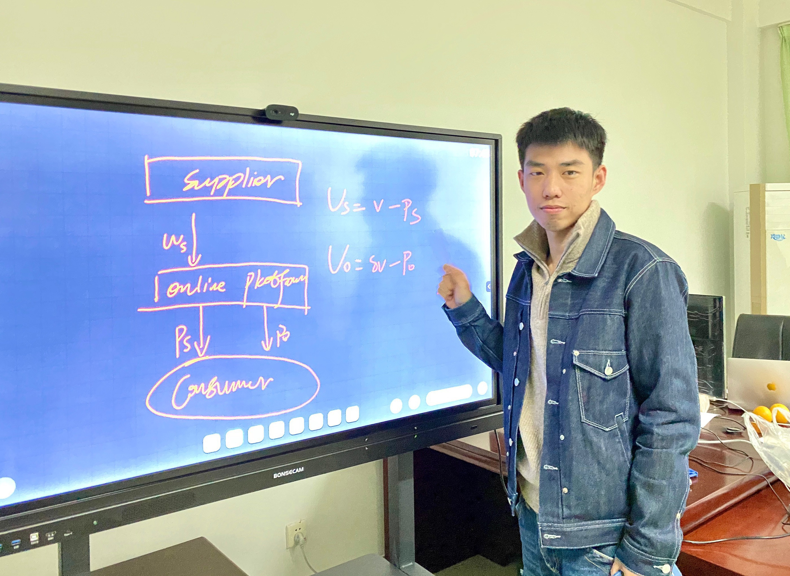

# Welcome to You Zhao's personal page

  

 I am a PhD student in the [School of Management, Guangdong University of Technology, China.](https://glxy.gdut.edu.cn/) My supervisor is Prof. Rui Hou. I obtained my Master degree in the [Environmental and Urban Engineering, Kansai University, Japan,](https://www.kansai-u.ac.jp/Fc_env/index.html) and supervised by Prof. Hiroshige Dan.

## Education
-Visiting PhD student, School of Management, University College London, United Kingdom, 2021.11-present (Supervisor: [Prof. Dongyuan Zhan](http://www.mgmt.ucl.ac.uk/people/dongyuanzhan))

-PhD student, School of Management, Guangdong University of Technology, China, 2020.9-present (Supervisor: [Prof. Rui Hou](https://glxy.gdut.edu.cn/info/1186/1461.htm))

-Master,  Environmental and Urban Engineering, Kansai University, Japan, 2018.4-2020.4 (Supervisor: [Prof. Hiroshige Dan](https://gakujo.kansai-u.ac.jp/profile/ja/5Ud2e89f8d0f01Nb4a7cac6a3a6ef.html))

-Research student,  Environmental and Urban Engineering, Kansai University, Japan, 2017.9-2018.3 (Supervisor: [Prof. Hiroshige Dan](https://gakujo.kansai-u.ac.jp/profile/ja/5Ud2e89f8d0f01Nb4a7cac6a3a6ef.html))

-Bachelor, School of Business, Hebei Agricultural University, China, 2013.9-2017.6
## Research Interests
Supply chain management, OM-marketing, Two-sided market, Omni-channel management

## Publications (#corresponding author)

### Selected papers
-You Zhao, Rui Hou, Xiaogang Lin#, Qiang Lin. Two-period information sharing in a supply chain under unique and differentiated wholesale pricing strategies. International Transactions in Operational Research, https:/doi.org/10.1111/itor.13081 (SSCI/SCI)

-Rui Hou, You Zhao, Mengqiang Zhu, Xiaogang Lin#. Price and quality decisions in a vertically differentiated supply chain with an “online-to-store” channel. Journal of Retailing and Consumer Services, (102593, Impact factor: 7.135, SSCI). 

-You Zhao, Zibin Cui, Jianxin Chen, Rui Hou#. Pricing and quality decisions in a supply chain with consumers' privacy concern. Journal of Industrial and Management Optimization，https://doi.org/10.3934/jimo.2021226  (SCI)

-You Zhao, Rui Hou#, Xinggang Luo. Two-period pricing strategy in a supply chain with intertemporal and horizontal reference price effects. INFOR: Information Systems and Operational Research, 2021,59（4）: 639-667 https://doi.org/10.1080/03155986.2021.1985903 （SCI）

-Rui Hou, Liang Li, Xiaogang Lin#, Yong Zha, You Zhao. Pricing strategy for logistics service platforms with competition and user distance preference. International Transactions in Operational Research, (http://doi.org/10.1111/itor.12973, Impact factor: 2.987, SCI/SSCI)

-You Zhao, Rui Hou#. Should a supplier engage in the marketplace? an equilibrium analysis in a hybrid-format supply chain. RAIRO- Operations Research, 55 (2021) 2639–2655, https://doi.org/10.1051/ro/2021122 (SCI)

-Rui Hou, Zibin Cui, You Zhao#. Pricing leadership decisions of competing firms with consumer learning. Managerial and Decision Economics, Accepted  (SSCI)

-Rui Hou, Weijian Li，Xiaogang Lin, You Zhao#. Impact of quality decisions on information sharing with supplier encroachment. RAIRO- Operations Research, https://doi.org/10.1051/ro/2021184  (SCI)
### Working papers
-You Zhao,Jianxin Chen, Rui Hou#. The value of information acquisition and sharing in an online intermediary platform. Major revision, Electronic Commerce Research.

-You Zhao, Rui Hou#, Manufacturer Encroachment with Carbon Cap-and-Trade Policy under Asymmetric Information.

-You Zhao, Rui Hou#, The Value of Blockchain-Powered Secondary Markets in the Presence of Socially Conscious.
### Conference (#corresponding author)
-You Zhao, Rui Hou, Xiaogang Lin#, Qiang Lin. Two-period information sharing in a supply chain under unique and differentiated wholesale pricing strategies, SSOM2021, Guangzhou, China

-You Zhao and Hiroshige Dan#, Optimization Model For Allocating Emergency Vehicles With Integration Dispatch, 2019 INFORMS Annual Meeting, Seattle, Washington, 2019/10/20-23.

-You Zhao and Hiroshige Dan#, Optimization model for emergency vehicle allocation with integration of dispatch under uncertainty, International Symposium on Scheduling 2019, Japan, 2019/7/5-7 (referee reading).

-You Zhao and Hiroshige Dan#, Optimization model for emergency vehicle allocation with integration of dispatch under uncertainty, The 2019 Fall National Conference of Operations Research Society of Japan, Japan, 2019/3/13-15 (in Japanese).

-You Zhao and Hiroshige Dan#, Optimization model for emergency vehicle allocation with integration of dispatch, The Summer seminar of Operations Research Society of Japan, Japan, 2018/10/2-4 (in Japanese). 

## Scholarship and award
-Visiting student supported by CSC，2021

-Guangdong University of Technology Graduate Innovation top talent，2021

-First class academic scholarship for Postgraduates of Guangdong University of Technology，2021

-Academic scholarship for Postgraduates of Guangdong University of Technology，2020

-Kansai University Benefit Scholarship，2019

-Japan Scheduling Society Encouragement Award，2019

-Kansai University Benefit Scholarship，2018
## Visitor counter
 
